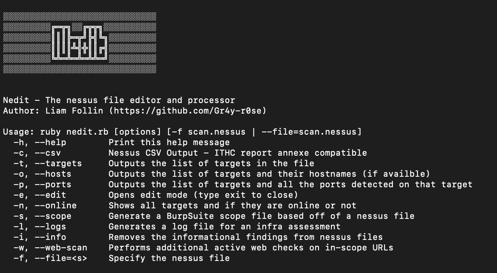

# nedit.rb
### A nessus editor/parser/querior for the exasperated pentester. 
NB: Nothing to do with NEdit, the open source text editor - but the name was too good to pass up.

<pre><code>░░░░░░░░░░░░░░░░░░░░░░░░░░░░░ 
░░░░░░░░░╔═╦╗░░╔╦╦╗░░░░░░░░░░  
░░░░░░░░░║║║╠═╦╝╠╣╚╗░░░░░░░░░ 
░░░░░░░░░║║║║╩╣╬║║╔╣░░░░░░░░░ 
░░░░░░░░░╚╩═╩═╩═╩╩═╝░░░░░░░░░ 
░░░░░░░░░░░░░░░░░░░░░░░░░░░░░ 
Nedit - The nessus file editor and processor
</code></pre>
## How to use

The help pages (-h or --help) give all the details needed to properly utilise this tool.

To use the scope functionality, load burp, navigate to the Targets tab, then Scope, then click on the cog icon and finally 'Load Options'. This will allow you to import the scope file properly.

## Who is Nedit for?

This tool was built in order to help PenTesters work with Nessus files. Stripping out informational findings, removing vulns alltogether or exporting to CSV nicely - it's all part of Nedit.

## To install all required modules, run the following command after git cloning:

<pre><code>bundle install
</code></pre>

